# BO DU LIEU BAO CAO DATN - LIFEQUEST

Nguon phan tich: source code trong `be/`, `mobile/`, `web/`, tai lieu noi bo trong `docs/` va `be/docs/`. Tai lieu nay chi tong hop thong tin co trong project; cac thong tin hanh chinh va so lieu chua thay trong source duoc danh dau `[MISSING INFORMATION]`.

---

# 1. THONG TIN HANH CHINH

## 1.1 Ten de tai

LifeQuest - ung dung mang xa hoi gamification voi nhiem vu doi thuc, xet duyet anh bang AI, goi y nhiem vu theo so thich/vi tri va quan tri noi dung.

## 1.2 Sinh vien thuc hien

[MISSING INFORMATION]

* Noi dung con thieu: ho ten sinh vien, ma sinh vien, lop, khoa/nganh.
* File can kiem tra: khong tim thay trong source code hien tai.
* Thong tin sinh vien can bo sung: ho ten, MSSV, lop, email neu can.

## 1.3 Giang vien huong dan

[MISSING INFORMATION]

* Noi dung con thieu: ho ten, hoc ham/hoc vi, bo mon/khoa cua giang vien huong dan.
* File can kiem tra: khong tim thay trong source code hien tai.
* Thong tin sinh vien can bo sung: thong tin GVHD theo mau bao cao cua truong.

## 1.4 Tom tat de tai

LifeQuest la mot he thong ung dung di dong ket hop mang xa hoi, gamification va xu ly anh bang AI nham khuyen khich nguoi dung thuc hien cac nhiem vu doi thuc. He thong cho phep nguoi dung dang ky, dang nhap bang tai khoan local hoac Google, xac thuc email bang OTP, thiet lap onboarding va so thich ca nhan. Sau khi hoan tat onboarding, nguoi dung co the xem danh sach quest, bat dau quest, chup anh lam bang chung, nop submission kem du lieu vi tri/POI va theo doi trang thai cua tung quest trong Quest Log.

Backend duoc xay dung bang FastAPI theo kien truc phan lop gom API router, service, repository, schema, model va worker. Du lieu duoc quan ly bang SQLAlchemy async, Alembic migrations va PostgreSQL theo cau hinh production; cac test cuc bo su dung SQLite database. He thong tich hop Redis cho OTP, cache, rate limit/online tracking va Celery cho tac vu nen nhu approval pipeline, notification va maintenance. Anh duoc upload qua service upload, luu metadata, hash, du lieu vi tri, sau do pipeline AI su dung Google Cloud Vision de lay label, tinh diem phu hop voi yeu cau quest, phat hien nghi van gian lan va dua ra trang thai approved, rejected hoac manual review.

Ung dung mobile duoc xay dung bang Expo/React Native, TypeScript va Expo Router. Cac man hinh chinh gom login/register/OTP, onboarding, home, quest log, quest detail, camera, camera result, notification, profile, post detail, chat va settings. He thong social cho phep tao bai dang tu do hoac gan voi quest/submission, xem feed, like, comment, follow/unfollow va xem ho so nguoi dung khac. Gamification duoc the hien qua XP, level, lich su XP, badge, featured badge va thong bao unlock badge. Ngoai mobile, project co web admin React/Vite de quan ly users, quests, posts, POI/map va badges.

He thong cung cap module recommendation cho quest dua tren rule-based scoring, so thich nguoi dung, du lieu vi tri, trang thai quest va log tuong tac; du lieu logging duoc thiet ke de phuc vu huan luyen ML/offline ranking ve sau. Nhin chung, LifeQuest tap trung vao bai toan tao dong luc thuc hien hoat dong ngoai doi thong qua nhiem vu, diem thuong, thanh tuu va tuong tac cong dong, dong thoi ung dung AI de tu dong hoa viec xac minh bang chung anh.

---

# 2. PHAN MO DAU

## 2.1 Ly do chon de tai

### Bai toan thuc te

Nguoi dung thuong kho duy tri thoi quen tich cuc va cac hoat dong ngoai doi neu thieu dong luc, phan thuong va cong dong. Project LifeQuest giai quyet bai toan nay bang cach bien cac hanh dong doi thuc thanh quest co XP, badge, feed xa hoi va bang chung anh.

### Nhu cau nguoi dung

* Co ung dung de nhan nhiem vu, chup anh minh chung va theo doi tien do.
* Co co che diem thuong, level, badge va notification de tao dong luc.
* Co feed xa hoi de chia se, like, comment va follow.
* Co goi y nhiem vu theo so thich va vi tri.
* Co luong onboarding de ca nhan hoa trai nghiem ban dau.

### Cac he thong tuong tu

[MISSING INFORMATION]

* Noi dung con thieu: danh sach va phan tich san pham doi sanh thuc te nhu Strava, Habitica, Pokemon GO, BeReal, Duolingo, cac ung dung habit tracker/gamification.
* File can kiem tra: khong co file research/benchmark doi thu trong project.
* Thong tin sinh vien can bo sung: bang so sanh chuc nang, uu/nhuoc diem cua tung he thong.

### Han che hien tai

Theo source hien co, mot so thong tin van chua co du lieu thuc nghiem: benchmark hieu nang, thong so server production, ket qua UAT, log kiem thu day du va anh man hinh final.

## 2.2 Muc tieu de tai

### Muc tieu tong quat

Xay dung he thong LifeQuest ho tro nguoi dung hoan thanh cac nhiem vu doi thuc thong qua ung dung di dong, xac minh bang chung bang anh/AI, trao thuong XP/badge, tao noi dung social feed va ca nhan hoa goi y quest.

### Muc tieu cu the

* Xay dung backend REST API bang FastAPI cho auth, user, quest, submission, social, badge, notification, recommendation va admin.
* Xay dung mobile app Expo/React Native voi luong auth, onboarding, home, quest log, camera, profile, notification, social va chat.
* Xay dung web admin React/Vite de quan ly users, quests, posts, POI va badges.
* Thiet ke database quan he bang SQLAlchemy models va Alembic migrations.
* Tich hop Google Cloud Vision vao pipeline xet duyet submission anh.
* Tich hop Redis/Celery cho OTP, cache, online tracking, rate limit va tac vu nen.
* Xay dung gamification gom XP, level, badge, lich su XP va notification.
* Xay dung recommendation service co logging va scoring giai thich duoc.

## 2.3 Pham vi nghien cuu

### Trong pham vi

* Ung dung mobile cho nguoi dung cuoi.
* Backend API, database schema, migration va service nghiep vu.
* Web admin quan tri.
* Xac thuc local/Google, OTP email, JWT/refresh token.
* Quest lifecycle: list, detail, start, submit, review, retry, Quest Log.
* AI review bang Google Cloud Vision va luong manual/admin action.
* Social feed, post, like, comment, follow.
* Gamification: XP, level, badge, notification.
* POI/location suggestion.
* Recommendation quest va logging event.

### Ngoai pham vi

* Thanh toan, thuong tien that, marketplace.
* He thong moderation nang cao cho tat ca noi dung text.
* CI/CD production day du chua thay trong source.
* Benchmark tai thuc te va quan sat nguoi dung quy mo lon chua co du lieu.
* Multi-tenant/microservice deployment chua thay trong source.

## 2.4 Phuong phap nghien cuu

* Phan tich source code backend, mobile, web, models, migrations va tests.
* Thiet ke he thong theo RESTful API, layered architecture va relational database.
* Ung dung gamification de tang dong luc nguoi dung.
* Ung dung Google Cloud Vision cho xac minh anh.
* Kiem thu bang pytest cho backend va lint/build cho frontend theo script project.

---

# 3. CHUONG 1 - CO SO LY THUYET

## Kien truc he thong

* Client-server: mobile app va web admin goi REST API backend.
* RESTful Architecture: backend expose endpoint duoi prefix `/api/v1`.
* Layered Architecture: API routes -> services -> repositories -> SQLAlchemy models.
* Monolith modular: backend nam trong mot FastAPI app, tach module theo domain.
* Background processing: Celery worker xu ly approval, notification, reward va maintenance.
* Event/log based recommendation: recommendation logging phuc vu scoring va huan luyen offline.

## Cong nghe Frontend

* Mobile: Expo `~54.0.33`, React Native `0.81.5`, React `19.1.0`, TypeScript `~5.9.2`.
* Routing mobile: `expo-router`.
* Navigation: React Navigation bottom tabs/native stack.
* Device features: `expo-camera`, `expo-location`, `expo-notifications`, `expo-image`, `expo-auth-session`, `expo-haptics`.
* Local storage: `@react-native-async-storage/async-storage`.
* Styling: NativeWind/TailwindCSS.
* State/context: AuthContext, UserContext, PostContext, ToastContext, XpGainContext, BadgeContext.
* Web admin: React `19.2.6`, Vite, React Router DOM, Axios, React Leaflet/Leaflet, Recharts, React Icons.

## Cong nghe Backend

* FastAPI va Uvicorn cho REST API.
* SQLAlchemy async va asyncpg cho PostgreSQL.
* Alembic cho database migration.
* Pydantic/Pydantic Settings cho schema va cau hinh.
* JWT bang PyJWT, password hashing bang bcrypt.
* Redis async cho cache, OTP, rate limit/online tracking.
* Celery Redis cho background tasks.
* Cloudinary va python-multipart cho upload anh.
* Google Cloud Vision va google-auth cho AI/Vision.
* pandas, numpy, scikit-learn, joblib cho pipeline ML/recommendation artifacts.
* pytest, pytest-asyncio, httpx cho test backend.

## Database

* Production stack trong dependency va docker-compose: PostgreSQL.
* ORM: SQLAlchemy 2.x async.
* Migration: Alembic trong `be/app/migrations/versions`.
* Database quan he gom users, quests, submissions, posts, likes, comments, follows, badges, notifications, POI, recommendation logs, chat, events.
* Uu diem: rang buoc khoa ngoai, enum, index, unique constraint, migration versioning va quan he M:N qua bang trung gian.

## AI va Machine Learning

* Google Cloud Vision: label detection cho submission anh.
* VisionService: `be/app/services/vision/vision_service.py`.
* AIApprovalService: `be/app/services/ai/ai_approval_service.py`.
* Approval pipeline: `be/app/services/pipeline/approval_pipeline.py`.
* Celery approval task: `be/app/workers/approval_tasks.py`.
* Recommendation ML/ranker: `be/app/services/recommendation/ml/` gom feature builder, training pipeline, synthetic data, ML ranker; artifact co `ml_artifacts/model.pkl` va `training_dataset.csv`.
* AI metadata/logging: `submissions.ai_metadata`, `submissions.vision_labels`, `submissions.vision_raw`, `ai_detection_logs`.

## DevOps

* Dockerfile va docker-compose trong `be/`.
* Git repository hien co.
* Alembic migration workflow.
* Redis/Celery worker setup.
* CI/CD: [MISSING INFORMATION]
  * Noi dung con thieu: file workflow GitHub Actions/GitLab CI/Jenkins khong tim thay.
  * File can kiem tra: `.github/workflows`, pipeline config neu co ngoai repo.
  * Thong tin sinh vien can bo sung: quy trinh build/test/deploy production.

---

# 4. CHUONG 2 - PHAN TICH VA THIET KE HE THONG

## 4.1 Yeu cau chuc nang

| Chuc nang | Mo ta | API lien quan | Man hinh lien quan |
|---|---|---|---|
| Dang ky | Tao user bang username, email, password | `POST /api/v1/auth/register` | `mobile/app/(auth)/register.tsx` |
| Dang nhap | Dang nhap username/password, cap JWT va refresh token | `POST /api/v1/auth/login` | `mobile/app/(auth)/login.tsx`, `web/src/pages/LoginPage.jsx` |
| Dang nhap Google | Xac thuc Google ID token | `POST /api/v1/auth/google/login` | `mobile/app/auth/callback.tsx` |
| OTP email | Xac thuc email, gui lai OTP | `POST /api/v1/auth/verify-email`, `POST /api/v1/auth/resend-otp` | `mobile/app/(auth)/otp-verification.tsx` |
| Quen/doi mat khau | Reset password bang OTP, doi mat khau khi dang nhap | `POST /api/v1/auth/forgot-password`, `POST /api/v1/auth/reset-password`, `POST /api/v1/auth/change-password` | `mobile/app/(main)/settings/change-password.tsx` |
| Quan ly ho so | Xem/cap nhat profile, public profile | `GET /api/v1/users/me`, `PATCH /api/v1/users/me`, `GET /api/v1/users/{target_user_id}` | `profile.tsx`, `edit-profile.tsx`, `other-profile/[id].tsx` |
| Onboarding/preferences | Luu so thich, activity level, location/notification setting | `POST /api/v1/users/me/preferences`, `GET /api/v1/users/me/preferences`, `GET /api/v1/categories` | `intro.tsx`, `permission.tsx`, `username.tsx`, `interests.tsx` |
| Quest list/detail | Hien thi quest active, chi tiet quest, Quest Log | `GET /api/v1/quests`, `GET /api/v1/quests/{quest_id}`, `GET /api/v1/quests/log` | `home.tsx`, `quest-log.tsx`, `quest-detail.tsx` |
| Quest lifecycle | Bat dau quest, nop anh minh chung | `POST /api/v1/quests/{quest_id}/start`, `POST /api/v1/quests/{quest_id}/submit` | `quest-detail.tsx`, `camera.tsx`, `camera-result.tsx` |
| AI review | Phan tich anh, tinh diem, approve/reject/manual review | Celery task, `PATCH /admin/submissions/{id}/approve`, `PATCH /admin/submissions/{id}/reject` | `camera-result.tsx`, `web/src/pages/PostsPage.jsx` |
| Upload anh | Upload image len service upload | `POST /api/v1/uploads/image` | `camera-result.tsx` |
| POI/location | Goi y POI theo lat/lng/accuracy | `GET /api/v1/pois/suggest`; admin POI CRUD | `home.tsx`, `camera.tsx`, `quest-detail.tsx`, `web/src/pages/MapPage.jsx` |
| Social feed | Feed, search, tao/xoa post | `GET /api/v1/social/feed`, `GET /api/v1/social/search`, `POST /api/v1/social/posts`, `DELETE /api/v1/social/posts/{post_id}` | `home.tsx`, `post-detail.tsx`, `camera-result.tsx` |
| Like/comment | Like/unlike post, tao/xem/xoa comment | `POST/DELETE /api/v1/social/posts/{post_id}/like`, `POST/GET /api/v1/social/posts/{post_id}/comments`, `DELETE /api/v1/social/comments/{comment_id}` | `PostCard`, `CommentSheet`, `post-detail.tsx` |
| Follow | Follow/unfollow, xem follower/following | `POST/DELETE /api/v1/social/users/{target_user_id}/follow`, `GET /followers`, `GET /following` | `profile.tsx`, `other-profile/[id].tsx` |
| XP/level | Luu XP transaction, xem lich su XP | `GET /api/v1/gamification/xp-history` | `profile.tsx`, `settings/xp-history.tsx` |
| Badge | Danh sach, featured, chi tiet badge; admin CRUD | `GET /api/v1/badges`, `GET /api/v1/badges/featured`, `GET /api/v1/badges/{badge_id}` | badge components, `profile.tsx`, `web/src/pages/BadgesPage.jsx` |
| Notification | Danh sach, unread count, read/read all, push token | `GET /api/v1/notifications`, `GET /unread-count`, `PATCH /{id}/read`, `PATCH /read-all`, `POST /push-tokens` | `notifications.tsx` |
| Recommendation | Goi y quest va log event | `GET /api/v1/recommendations/quests`, `POST /api/v1/recommendations/events`, `POST /api/v1/recommendations/log` | `home.tsx`, services recommendation |
| Event | Tao/xem/sua/ket thuc event, leaderboard, posts | `GET/POST /api/v1/events`, `GET/PATCH /api/v1/events/{event_id}`, `POST /end`, `GET /leaderboard`, `GET /posts` | `event-detail.tsx` |
| Chat | Conversation va message 1-1 | `GET/POST /api/v1/chat/conversations`, `GET/POST /messages`, `POST /read` | `chat.tsx`, `chat-detail.tsx` |
| Admin | Quan ly users, quests, posts/comments, badges, POIs, XP adjust | `/api/v1/admin/*` | web admin pages |

### Danh sach router/API phat hien

* Auth: `/api/v1/auth/register`, `/login`, `/google/login`, `/verify-email`, `/resend-otp`, `/change-password`, `/forgot-password`, `/reset-password`, `/refresh`, `/logout`.
* Users: `/api/v1/users/me`, `/users/{target_user_id}`, `/users/{user_id}/online`, `/users/me/preferences`.
* Categories: `/api/v1/categories`.
* Quests: `/api/v1/quests`, `/quests/log`, `/quests/{quest_id}`, `/quests/{quest_id}/start`, `/quests/{quest_id}/submit`, `/quests/recommend-from-image`.
* POIs: `/api/v1/pois/suggest`.
* Submissions: `/api/v1/submissions/{submission_id}`, `/api/v1/admin/submissions`, `/api/v1/admin/submissions/{submission_id}/approve`, `/reject`.
* Recommendations: `/api/v1/recommendations/quests`, `/events`, `/log`.
* Social: `/api/v1/social/feed`, `/search`, `/posts`, `/posts/{post_id}`, `/posts/{post_id}/like`, `/posts/{post_id}/comments`, `/comments/{comment_id}`, `/users/{target_user_id}/follow`, `/followers`, `/following`.
* Events: `/api/v1/events`, `/events/{event_id}`, `/events/{event_id}/end`, `/leaderboard`, `/posts`.
* Chat: `/api/v1/chat/conversations`, `/chat/conversations/{conversation_id}/messages`, `/read`.
* Gamification: `/api/v1/gamification/xp-history`.
* Badges: `/api/v1/badges`, `/badges/featured`, `/badges/{badge_id}`.
* Uploads: `/api/v1/uploads/image`.
* Notifications: `/api/v1/notifications`, `/unread-count`, `/{notification_id}/read`, `/read-all`, `/push-tokens`, `/push-tokens/unregister`.
* Admin: `/api/v1/admin/users`, `/users/{user_id}/ban`, `/users/{user_id}`, `/users/{user_id}/xp-adjust`, `/quests`, `/quests/{quest_id}`, `/posts`, `/posts/{post_id}`, `/posts/{post_id}/comments`, `/comments/{comment_id}`, `/badges`, `/badges/condition-types`, `/badges/{badge_id}`, `/pois`, `/pois/{poi_id}`.

## 4.2 Yeu cau phi chuc nang

* Hieu nang: phan trang API, index database, Redis cache/rate limit, Celery background task cho tac vu nang.
* Bao mat: JWT access token, refresh token rotation, bcrypt password hashing, role admin/user, ban user, CORS, rate limit, OTP qua Redis.
* Kha nang mo rong: kien truc module theo domain, service/repository layer, migrations, workers, recommendation pipeline co logging.
* Tinh kha dung: health check `/health`, middleware error handler/logging, Redis/database startup check.
* Tinh nhat quan du lieu: foreign key, unique constraint, enum status, xp ledger tranh cap XP trung, unique user_quest theo user/quest/poi.

## 4.3 Tac nhan he thong

* Guest: dang ky, dang nhap, reset password, xac thuc OTP.
* User: lam quest, nop anh, dang bai, like/comment/follow, xem profile, nhan XP/badge/notification.
* Admin: quan ly users, quests, posts/comments, submissions, badges, POIs, dieu chinh XP.
* AI Service: Google Vision/AIApprovalService xu ly submission.
* Notification Service: tao notification, unread count, push token, toast XP/badge.
* Recommendation Service: tinh diem, goi y quest, log event.
* Celery Worker: xu ly approval, reward, notification, maintenance.

## 4.4 Use Case

### Danh sach Use Case

1. Dang ky tai khoan.
2. Dang nhap.
3. Xac thuc email bang OTP.
4. Hoan tat onboarding.
5. Cap nhat ho so.
6. Xem danh sach quest.
7. Bat dau quest.
8. Nop anh hoan thanh quest.
9. AI xet duyet submission.
10. Retry submission bi tu choi.
11. Nhan XP va cap nhat level.
12. Nhan badge.
13. Tao bai dang tu do.
14. Like/comment/follow.
15. Xem notification.
16. Nhan goi y quest.
17. Chat 1-1.
18. Admin duyet submission.
19. Admin quan ly quest/POI/badge/user.

### Mo ta Use Case tieu bieu

#### UC01 - Dang nhap

* Actor: Guest.
* Dieu kien tien quyet: user da co tai khoan, khong bi ban.
* Luong chinh: nhap username/password -> mobile goi `POST /api/v1/auth/login` -> backend xac thuc bcrypt -> tao access token va refresh token -> client luu token -> dieu huong theo onboarding.
* Luong thay the: sai mat khau tra loi 401; user bi khoa bi chan; token het han dung refresh.
* Ket qua: user dang nhap thanh cong va co phien lam viec hop le.

#### UC02 - Hoan thanh Quest

* Actor: User.
* Dieu kien tien quyet: da dang nhap, onboarding completed.
* Luong chinh: xem quest -> mo detail -> start quest -> chup anh -> upload -> submit quest -> submission vao pipeline -> neu approved thi quest completed, cap XP va notification.
* Luong thay the: anh khong dat yeu cau bi rejected; co retry neu con luot; loi Vision co the manual review.
* Ket qua: user_quest cap nhat status, submission luu metadata, XP/badge/notification duoc tao neu dat dieu kien.

#### UC03 - Tao bai dang

* Actor: User.
* Dieu kien tien quyet: da dang nhap.
* Luong chinh: mo camera -> chup/chon anh -> upload -> nhap caption/POI neu co -> goi `POST /api/v1/social/posts` -> post xuat hien tren feed.
* Luong thay the: loi upload; user huy POI suggestion; xoa post sau khi tao.
* Ket qua: post moi duoc luu voi image_url, caption, user_id va thong tin quest/POI neu co.

#### UC04 - AI xet duyet anh

* Actor: AI Service, Celery Worker.
* Dieu kien tien quyet: submission da duoc tao.
* Luong chinh: worker nhan submission_id -> VisionService lay labels -> AIApprovalService tinh score theo quest labels/rules/location -> cap nhat status approved/rejected/manual_review -> log metadata.
* Luong thay the: Vision API timeout/loi credential -> manual review va ghi cheat_flags/error.
* Ket qua: submission co status va ai_score, user_quest duoc cap nhat theo ket qua.

#### UC05 - Nhan Badge

* Actor: User, Badge Service.
* Dieu kien tien quyet: user co hanh dong dat dieu kien badge.
* Luong chinh: sau event quest/social/xp -> badge service kiem tra criteria -> tao user_badges neu chua co -> tao notification `badge_unlocked`.
* Luong thay the: badge hidden/inactive khong hien thi hoac khong award.
* Ket qua: user mo khoa thanh tuu va mobile hien celebration/toast.

## 4.5 Activity Diagram

### Dang nhap

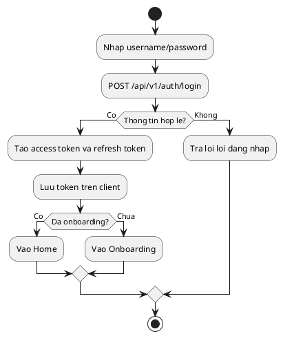

### Hoan thanh Quest

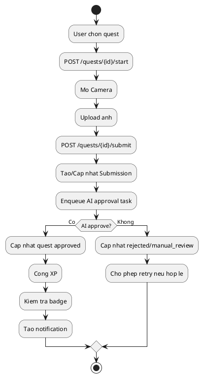

### AI xet duyet anh

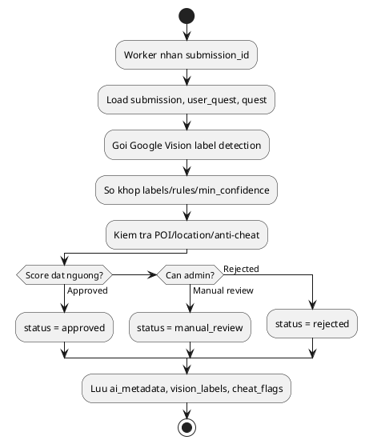

### Tao bai dang

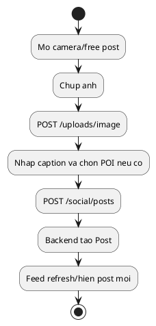

### Nhan Badge

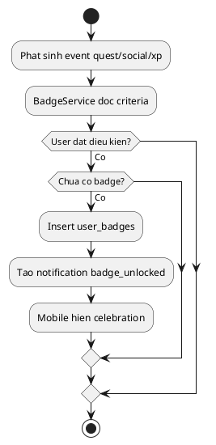

## 4.6 Sequence Diagram

### Login

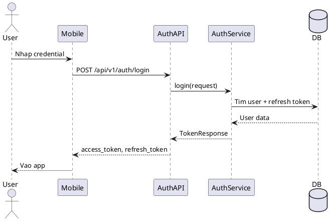

### Quest Flow

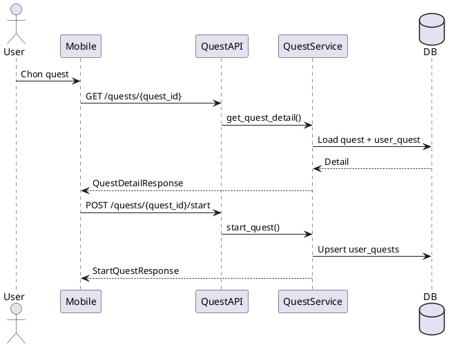

### Submission Flow

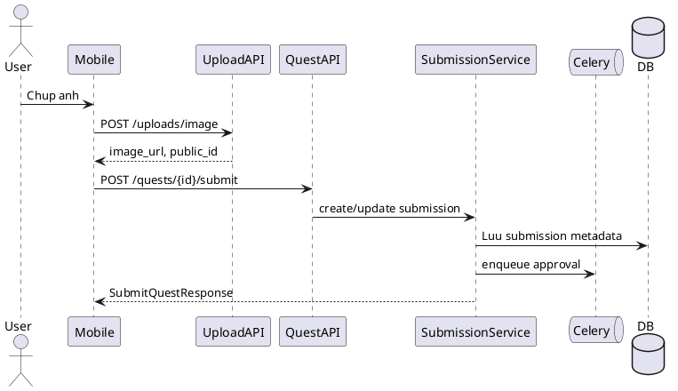

### AI Approval Flow

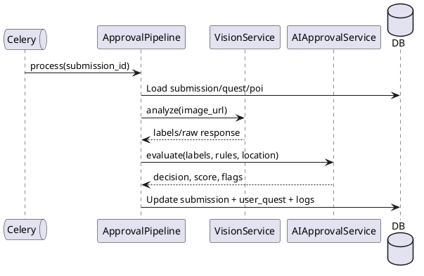

### Recommendation Flow

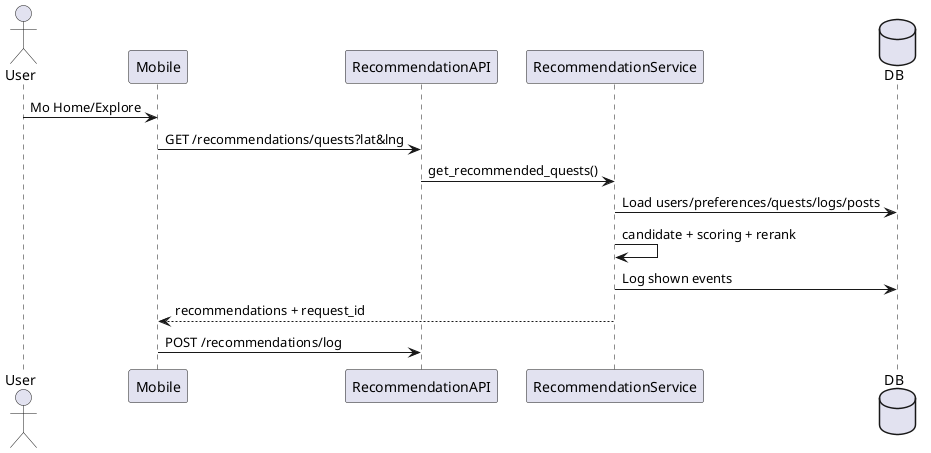

## 4.7 Database Design

### Tong quan bang

| Bang | Chuc nang | Cot chinh | Quan he |
|---|---|---|---|
| `users` | Tai khoan va profile | `id`, `username`, `email`, `password_hash`, `provider`, `role`, `xp`, `level_id`, `is_verified`, `is_banned`, `onboarding_completed` | N-1 `levels`; 1-1 `user_preferences`; 1-N posts/comments/likes/notifications/badges |
| `levels` | Moc level | `id`, `name`, `required_xp` | 1-N users |
| `refresh_tokens` | Refresh token hash | `id`, `user_id`, `token_hash`, `is_revoked`, `expires_at` | N-1 users |
| `user_preferences` | So thich/onboarding | `user_id`, `interests`, `interest_weights`, `activity_level`, `location_enabled`, `notification_enabled` | 1-1 users |
| `categories` | Danh muc quest | `id`, `slug`, `name`, `icon` | M-N quests |
| `quests` | Dinh nghia quest | `id`, `title`, `description`, `vision_spec`, `labels`, `label_rules`, `xp_reward`, `difficulty`, `location_required`, `is_active` | M-N categories; 1-N user_quests; M-N events |
| `quest_categories` | Bang noi quest-category | `quest_id`, `category_id` | FK quests/categories |
| `user_quests` | Trang thai quest theo user/POI | `id`, `user_id`, `quest_id`, `poi_id`, `status`, `started_at`, `expires_at`, `consolation_xp` | N-1 users/quests/pois; 1-1 submissions |
| `quest_instances` | Instance quest theo user + POI | `quest_id`, `user_id`, `poi_id`, `created_at` | FK quests/users/pois |
| `submissions` | Anh va metadata nop quest | `id`, `user_quest_id`, `image_url`, `file_hash`, `vision_labels`, `ai_metadata`, `lat`, `lng`, `poi_id`, `ai_score`, `status`, `is_suspicious` | 1-1 user_quests/posts; N-1 pois; 1-N ai_detection_logs |
| `posts` | Bai dang social | `id`, `submission_id`, `quest_id`, `poi_id`, `event_id`, `user_id`, `image_url`, `caption`, `like_count`, `comment_count`, `location_name` | N-1 users/quests/pois/events; 1-N likes/comments |
| `follows` | Quan he follow | `follower_id`, `following_id`, `created_at` | FK users-users |
| `likes` | Like post | `user_id`, `post_id`, `created_at` | FK users/posts |
| `comments` | Binh luan va reply | `id`, `post_id`, `user_id`, `parent_id`, `content`, `is_deleted` | FK posts/users/comments |
| `badges` | Dinh nghia badge | `id`, `name`, `description`, `icon_url`, `rarity`, `category`, `criteria`, `is_hidden`, `is_active`, `sort_order` | 1-N user_badges |
| `user_badges` | Badge da dat | `id`, `user_id`, `badge_id`, `earned_at` | FK users/badges |
| `xp_transactions` | So cai XP | `id`, `user_id`, `submission_id`, `amount`, `source`, `created_at` | FK users/submissions |
| `notifications` | Thong bao in-app | `id`, `user_id`, `type`, `data`, `is_read`, `created_at` | N-1 users |
| `user_push_tokens` | Token push device | `id`, `user_id`, `token`, `provider`, `platform`, `is_active`, `last_seen_at` | N-1 users |
| `pois` | Diem quan tam | `id`, `name`, `poi_type`, `latitude`, `longitude`, `radius_m`, `source`, `external_id`, `external_type`, `is_active` | 1-N submissions/posts/user_quests |
| `recommendation_logs` | Log event goi y | `id`, `user_id`, `quest_id`, `post_id`, `event`, `score`, `rank`, `request_id`, `algorithm_version` | FK users/quests/posts |
| `ai_detection_logs` | Log Vision/AI | `id`, `submission_id`, `model_version`, `labels`, `ocr_text`, `confidence_stats`, `raw_response` | N-1 submissions |
| `audit_logs` | Audit admin/user | `id`, `actor_id`, `action`, `target_type`, `target_id`, `metadata` | N-1 users |
| `events` | Su kien/chien dich | `id`, `title`, `description`, `banner_url`, `start_at`, `end_at`, `status`, `reward_config`, `created_by` | M-N quests; 1-N posts/results |
| `event_quests` | Bang noi event-quest | `event_id`, `quest_id` | FK events/quests |
| `event_results` | Ket qua event | `event_id`, `user_id`, `post_id`, `total_likes`, `rank`, `bonus_xp`, `badge_id`, `awarded_at` | FK events/users/posts/badges |
| `conversations` | Chat 1-1 | `id`, `user_one_id`, `user_two_id`, `last_message_id`, `last_message_at` | FK users/messages |
| `messages` | Tin nhan chat | `id`, `conversation_id`, `sender_id`, `content`, `message_type`, `read_at`, `created_at` | FK conversations/users |

### Rang buoc va chi muc noi bat

* `users.username`, `users.email` unique/index.
* `refresh_tokens.token_hash` unique.
* `user_preferences.user_id` unique.
* `quest_categories` composite primary key.
* `follows` va `likes` composite primary key.
* `submissions.file_hash`, `submissions.status/is_suspicious`, `pois.latitude/longitude`, `recommendation_logs.request_id/event` co index.
* `pois` unique theo `source`, `external_id`.
* `xp_transactions.submission_id` co unique constraint de tranh cap XP trung cho cung submission.

### ERD Mermaid

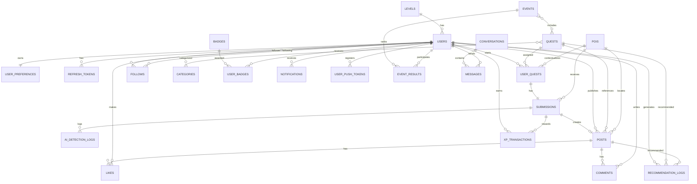

### ERD PlantUML

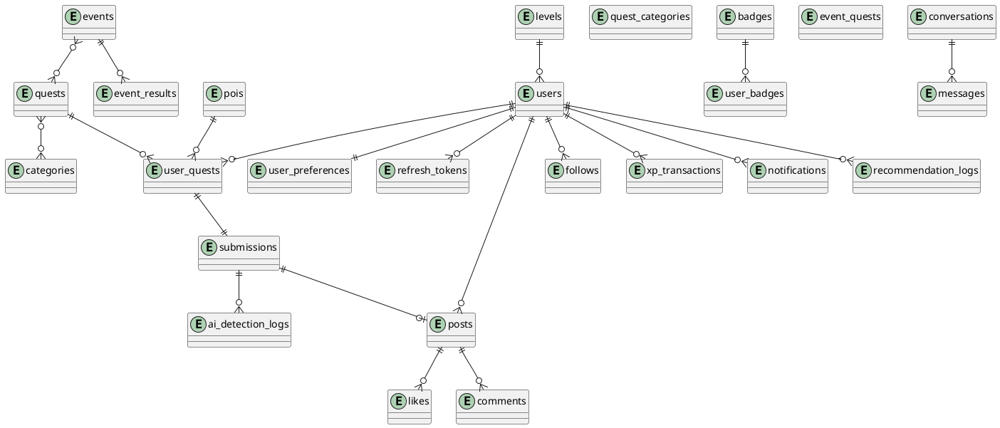

---

# 5. CHUONG 3 - TRIEN KHAI VA KIEM THU

## 5.1 Moi truong trien khai

### Backend

* Python FastAPI app trong `be/app`.
* Chay bang Uvicorn.
* Dependency trong `be/requirements.txt`.
* Dockerfile va docker-compose co trong `be/`.

### Frontend

* Mobile: Expo/React Native trong `mobile/`.
* Web admin: React/Vite trong `web/`.

### Database

* PostgreSQL cho moi truong chinh theo dependency `asyncpg` va docker-compose.
* Alembic migrations trong `be/app/migrations/versions`.
* SQLite test database co trong workspace: `test_lifequest.db`, `test_quest.db`, `test_recommendation.db` va cac db test trong `be/`.

### Cloud

* Cloudinary dependency cho upload anh.
* Google Cloud Vision can `GOOGLE_APPLICATION_CREDENTIALS`.
* Thong so server/cloud production: [MISSING INFORMATION]
  * Noi dung con thieu: host, domain, CPU/RAM, storage, network, provider, deployment URL.
  * File can kiem tra: `.env`, tai lieu deployment ngoai repo, cloud dashboard.
  * Thong tin sinh vien can bo sung: cau hinh server va moi truong demo.

### AI Service

* Google Cloud Vision label detection.
* Service account JSON duoc cau hinh qua bien moi truong.
* Vision failure co the dua submission ve manual review theo tai lieu handoff.

## 5.2 Chuc nang da trien khai

| Chuc nang | Mo ta | API | Screenshot can chup |
|---|---|---|---|
| Auth | register/login/Google/OTP/refresh/logout/password | `/auth/*` | Login, Register, OTP, Forgot/Reset/Change Password |
| Onboarding | intro, permission, username, interests | `/users/me/preferences`, `/categories` | Intro, Permission, Username, Interests |
| Home/Explore | feed, recommendation, quest sections | `/social/feed`, `/recommendations/quests`, `/quests` | Home |
| Quest | list, detail, start, submit, log | `/quests/*` | Quest Log, Quest Detail, Camera Result |
| Camera/upload | chup anh, upload, submit/free post | `/uploads/image`, `/quests/{id}/submit`, `/social/posts` | Camera, Camera Result |
| AI approval | Vision labels, score, status, admin review | worker + `/admin/submissions/*` | Admin submissions/post moderation |
| Social | post, like, comment, follow | `/social/*` | Feed, Post Detail, Comment Sheet, Other Profile |
| Profile | thong tin ca nhan, XP, badge, posts | `/users/me`, `/users/{id}`, `/badges/*` | Profile, Edit Profile |
| Gamification | XP history, level progress, badge unlock | `/gamification/xp-history`, `/badges/*` | XP History, Badge Modal/Celebration |
| Notification | unread, read, push tokens | `/notifications/*` | Notifications |
| POI/map | suggest POI, admin POI CRUD | `/pois/suggest`, `/admin/pois*` | Map Admin, POI suggestion |
| Event | event detail, leaderboard, posts | `/events/*` | Event Detail |
| Chat | conversations/messages/read | `/chat/*` | Chat List, Chat Detail |
| Web Admin | dashboard, users, quests, posts, map, badges | `/admin/*` | Dashboard, Users, Quests, Posts, Map, Badges |

## 5.3 Danh sach man hinh

### Mobile app

* Root/Layout: `mobile/app/_layout.tsx`, `mobile/app/index.tsx`.
* Auth: `login.tsx`, `register.tsx`, `otp-verification.tsx`, `auth/callback.tsx`.
* Onboarding: `intro.tsx`, `permission.tsx`, `username.tsx`, `interests.tsx`.
* Main tabs: `home.tsx`, `quest-log.tsx`, `camera.tsx`, `notifications.tsx`, `profile.tsx`, `chat.tsx`.
* Detail/modals: `quest-detail.tsx`, `post-detail.tsx`, `event-detail.tsx`, `chat-detail.tsx`, `camera-result.tsx`, `other-profile/[id].tsx`.
* Settings: `settings/index.tsx`, `settings/edit-profile.tsx`, `settings/change-password.tsx`, `settings/xp-history.tsx`.

### Web admin

* `DashboardPage.jsx`.
* `LoginPage.jsx`.
* `UsersPage.jsx`.
* `QuestsPage.jsx`.
* `PostsPage.jsx`.
* `MapPage.jsx`.
* `BadgesPage.jsx`.

## 5.4 Test Case

| ID | Chuc nang | Input | Ket qua mong muon | Ket qua thuc te | Status |
|---|---|---|---|---|---|
| TC01 | Dang ky | username/email/password hop le | Tao user moi, gui OTP neu cau hinh | Can chay test/UAT | Pending |
| TC02 | Dang ky trung email | email da ton tai | Tra loi loi conflict/validation | Can chay test/UAT | Pending |
| TC03 | Dang nhap | username/password dung | Tra access token va refresh token | Co test `tests/test_auth.py` | Implemented |
| TC04 | Dang nhap sai | password sai | Tra 401/loi dang nhap | Co test auth | Implemented |
| TC05 | Google login | id_token hop le | Dang nhap/tao user provider google | Can test voi Google env | Pending |
| TC06 | Xac thuc OTP | email + OTP hop le | `is_verified=true` | Can test voi Redis/email | Pending |
| TC07 | Refresh token | refresh token hop le | Cap token moi, revoke token cu | Co router/service | Implemented |
| TC08 | Logout | refresh token | Revoke token, 204 | Co router/service | Implemented |
| TC09 | Update preferences | interests/activity_level | Luu preference, onboarding completed | Co service/API | Implemented |
| TC10 | Get me | access token hop le | Tra profile user | Co API | Implemented |
| TC11 | Update profile | display_name/bio/avatar | Cap nhat profile | Co API | Implemented |
| TC12 | List quests | page/page_size | Tra danh sach quest active | Co test `test_quest.py` | Implemented |
| TC13 | Quest detail | quest_id hop le | Tra chi tiet va user status | Co service/API | Implemented |
| TC14 | Start quest | quest_id hop le | Tao/cap nhat user_quest started | Co test quest flow | Implemented |
| TC15 | Submit quest | image_url/hash/location | Tao submission va enqueue approval | Co test submission | Implemented |
| TC16 | Retry quest rejected | submission rejected + retry | Cap nhat submission/post cu, tang retry | Co source flow | Implemented |
| TC17 | AI approve | anh co label dat yeu cau | Submission approved, cong XP | Co test `test_ai_approval.py` | Implemented |
| TC18 | AI reject | anh khong dat label | Submission rejected, ly do tu choi | Co test AI/submission | Implemented |
| TC19 | Vision service loi | sai credential/timeout | Manual review/log error | Can test integration | Pending |
| TC20 | Upload image | file anh hop le | Tra image_url/public_id | Co API | Implemented |
| TC21 | POI suggest | lat/lng/accuracy | Tra POI gan nhat hoac null | Co service/API | Implemented |
| TC22 | Free post | image_url/caption | Tao post khong bat buoc quest | Co test social | Implemented |
| TC23 | Feed | token hop le | Tra danh sach post | Co test social | Implemented |
| TC24 | Like post | post_id hop le | Tang like_count, tao like | Co test social | Implemented |
| TC25 | Unlike post | post_id da like | Giam like_count, xoa like | Co test social | Implemented |
| TC26 | Comment post | content hop le | Tao comment, tang comment_count | Co test social | Implemented |
| TC27 | Follow user | target_user_id | Tao follow, notification neu co | Co API/source | Implemented |
| TC28 | XP history | user co transaction | Tra danh sach XP | Co API | Implemented |
| TC29 | Badge list | token hop le | Tra badge/progress/featured | Co API/admin | Implemented |
| TC30 | Unlock badge | user dat criteria | Tao user_badges, notification | Co badge service | Implemented |
| TC31 | Notification unread | user co notification | Tra unread count | Co API | Implemented |
| TC32 | Mark read all | user co unread | Tat ca notification read | Co API | Implemented |
| TC33 | Recommendation quests | preferences/location | Tra request_id, score/reasons | Co test `test_recommendation.py` | Implemented |
| TC34 | Log recommendation event | shown/clicked/started | Ghi recommendation_logs | Co API/service | Implemented |
| TC35 | Chat conversation | target user | Tao/tra conversation | Co API/source | Implemented |
| TC36 | Admin ban user | admin token + user_id | Cap nhat is_banned | Co API/admin service | Implemented |
| TC37 | Admin update quest | payload quest | Cap nhat quest | Co API/admin service | Implemented |
| TC38 | Admin manage POI | create/update/delete POI | POI thay doi trong DB | Co API/admin service | Implemented |
| TC39 | Admin manage badge | create/update/delete badge | Badge thay doi trong DB | Co API/admin service | Implemented |
| TC40 | Web admin build | `npm run build` | Build thanh cong | Chua chay trong phien nay | Pending |

---

# 6. KET LUAN

## Ket qua dat duoc

* Hoan thien backend FastAPI voi cac module auth, user, quest, submission, social, recommendation, badge, gamification, notification, POI, event, chat va admin.
* Hoan thien mobile app Expo/React Native voi auth, onboarding, home, quest, camera, social, profile, notification, chat va settings.
* Hoan thien web admin React/Vite cho quan tri users, quests, posts, POIs/map va badges.
* Thiet ke schema quan he day du va migration Alembic.
* Tich hop Google Cloud Vision vao luong AI approval.
* Co test backend cho auth, quest, submission, social, recommendation, AI approval va admin.

## Uu diem he thong

* Kien truc module ro rang, de mo rong theo domain.
* Ket hop gamification, social feed va AI validation trong mot trai nghiem thong nhat.
* Co POI/location va quest instance theo user + quest + POI, tranh tinh trung quest theo dia diem.
* Co recommendation logging va scoring giai thich duoc, san sang cho ML ranking.
* Co web admin de ho tro van hanh va kiem duyet.

## Han che

* Chua thay CI/CD workflow trong source.
* Chua co thong so benchmark hieu nang va tai thuc te.
* Chua co anh man hinh final trong tai lieu.
* Chua co tai lieu nghien cuu doi thu/so sanh he thong tuong tu.
* Google Vision phu thuoc credential va cloud config ngoai repo.
* Mot so tai lieu hien co bi loi encoding, can chuan hoa khi dua vao bao cao chinh thuc.

## Huong phat trien

* Bo sung CI/CD, staging/production deployment va monitoring.
* Hoan thien dashboard KPI cho admin: DAU, quest completion, AI approval rate, retention.
* Mo rong AI moderation cho caption/comment va safe search.
* Huan luyen va tich hop ML ranker tu recommendation_logs.
* Bo sung leaderboard, event reward nang cao va season/challenge.
* Toi uu offline support, push notification production va deep link.
* Bo sung benchmark, test UAT va bao cao kha dung/hieu nang.

---

# 7. TAI LIEU THAM KHAO

* FastAPI Documentation.
* SQLAlchemy 2.0 Documentation.
* Alembic Documentation.
* PostgreSQL Documentation.
* Redis Documentation.
* Celery Documentation.
* PyJWT Documentation va JWT RFC 7519.
* Google Cloud Vision API Documentation.
* Cloudinary Documentation.
* Expo Documentation.
* React Native Documentation.
* Expo Router Documentation.
* React Navigation Documentation.
* React Documentation.
* Vite Documentation.
* Leaflet/React Leaflet Documentation.
* scikit-learn Documentation.
* pytest Documentation.

---

# 8. DANH SACH THONG TIN CON THIEU

* Thong tin sinh vien: ho ten, MSSV, lop, khoa/nganh, email.
* Ten giang vien huong dan va don vi cong tac.
* Ten de tai chinh thuc theo quyet dinh/ma de tai.
* Anh giao dien final cua mobile va web admin.
* Thong so server/cloud production: domain, host, CPU/RAM, database, storage, backup.
* Cau hinh `.env` production da an toan de trich dan: database URL mau, Redis URL, Cloudinary, Google credentials.
* Ket qua benchmark API, database, upload va AI approval latency.
* Ket qua chay test moi nhat: pytest, mobile lint, web build.
* Nhat ky kiem thu UAT/manual test.
* Tai lieu so sanh cac he thong tuong tu.
* So lieu nguoi dung mau, quy mo du lieu seed/demo, anh minh hoa submission.
* CI/CD pipeline va quy trinh release.
* Chinh sach bao mat/bao ve du lieu nguoi dung neu can cho bao cao.

---

# CHECKLIST DU LIEU

| Muc | Trang thai | Ghi chu |
|---|---|---|
| Cau truc source backend/mobile/web | Da co | Lay tu `rg --files` va thu muc project |
| Cong nghe backend | Da co | `be/requirements.txt` |
| Cong nghe mobile/web | Da co | `mobile/package.json`, `web/package.json` |
| API/router FastAPI | Da co | `be/app/api/v1/*` |
| Database schema | Da co | `be/app/models/*`, `docs/db_schema.md` |
| Alembic migration | Da co | `be/app/migrations/versions/*` |
| AI/Vision flow | Da co | `be/docs/vision_ai_handoff.md`, service/worker source |
| Recommendation flow | Da co | `docs/recommendation_v2_summary.md`, recommendation service/API |
| Man hinh mobile/web | Da co | `mobile/app/*`, `web/src/pages/*` |
| Test cases | Da co o muc thiet ke | Co tests backend; ket qua chay moi nhat chua thu trong phien nay |
| Thong tin hanh chinh | Thieu | Can nguoi dung bo sung |
| Screenshot | Thieu | Can chup tu app/web |
| Benchmark va deployment | Thieu | Chua co du lieu trong source |
| Tai lieu tham khao | Da co danh sach de xuat | Can chuan hoa format theo quy dinh truong neu co |
