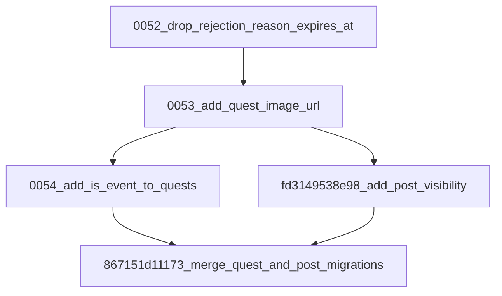

# Tổng hợp các thay đổi về Cơ sở dữ liệu (Database Changes) từ bản ghi 0053 trở đi

Tài liệu này tổng hợp chi tiết tất cả các thay đổi về cấu trúc cơ sở dữ liệu (schema migrations) kể từ bản ghi (migration) `0053_add_quest_image_url` (bao gồm chính nó) trở đi trong dự án.

---

## 1. Sơ đồ nhánh Migration (Alembic Dependency Graph)

Dưới đây là luồng phụ thuộc giữa các file migration từ bản ghi 52 trở đi. Hệ thống alembic phân nhánh từ bản ghi 53 và sau đó gộp lại (merge) tại bản ghi `867151d11173`.



---

## 2. Chi tiết các thay đổi cấu trúc bảng (Schema Changes)

### Bảng tổng hợp các cột mới
| Tên Bảng (`__tablename__`) | Tên Cột | Kiểu Dữ Liệu | Ràng Buộc (Constraints) | Giá trị mặc định (Default) | Ý nghĩa |
| :--- | :--- | :--- | :--- | :--- | :--- |
| `quests` | `image_url` | `VARCHAR(500)` | `Nullable` | `NULL` | Lưu trữ link ảnh minh họa cho quest |
| `quests` | `is_event` | `BOOLEAN` | `NOT NULL` | `false` | Đánh dấu quest này thuộc dạng Event (Sự kiện) |
| `posts` | `visibility` | `post_visibility_enum` | `NOT NULL` | `'public'` | Thiết lập chế độ hiển thị bài viết |

---

## 3. Chi tiết từng File Migration và Model tương ứng

### 3.1. Migration: `0053_add_quest_image_url`
- **File**: [0053_add_quest_image_url.py](file:///d:/DATN/be/app/migrations/versions/0053_add_quest_image_url.py)
- **Revision ID**: `0053_add_quest_image_url`
- **Revises (Down Revision)**: `0052_drop_rejection_reason_expires_at`
- **Nội dung thay đổi (Upgrade)**:
  - Thêm cột `image_url` vào bảng `quests` để lưu trữ URL hình ảnh đại diện cho các Quest (nhiệm vụ).
  - Kiểu dữ liệu: `sa.String(length=500)`
  - Cho phép `NULL` (nullable=True).
- **Model SQLAlchemy tương ứng**:
  - Class: `Quest` trong [quest.py](file:///d:/DATN/be/app/models/quest.py)
  - Khai báo:
    ```python
    image_url: Mapped[str | None] = mapped_column(String(500), nullable=True)
    ```

---

### 3.2. Migration: `0054_add_is_event_to_quests`
- **File**: [0054_add_is_event_to_quests.py](file:///d:/DATN/be/app/migrations/versions/0054_add_is_event_to_quests.py)
- **Revision ID**: `0054_add_is_event_to_quests`
- **Revises (Down Revision)**: `0053_add_quest_image_url`
- **Nội dung thay đổi (Upgrade)**:
  - Thêm cột `is_event` vào bảng `quests` để đánh dấu một Quest có phải là Quest thuộc về sự kiện (Event) hay không.
  - Kiểu dữ liệu: `sa.Boolean()`
  - Không cho phép `NULL` (nullable=False).
  - Mặc định phía database (server_default): `false`.
- **Model SQLAlchemy tương ứng**:
  - Class: `Quest` trong [quest.py](file:///d:/DATN/be/app/models/quest.py)
  - Khai báo:
    ```python
    is_event: Mapped[bool] = mapped_column(Boolean, nullable=False, default=False)
    ```

---

### 3.3. Migration: `fd3149538e98_add_post_visibility`
- **File**: [fd3149538e98_add_post_visibility.py](file:///d:/DATN/be/app/migrations/versions/fd3149538e98_add_post_visibility.py)
- **Revision ID**: `fd3149538e98`
- **Revises (Down Revision)**: `0053_add_quest_image_url`
- **Nội dung thay đổi (Upgrade)**:
  - Khởi tạo kiểu dữ liệu Enum mới tên là `post_visibility_enum` với 3 giá trị: `'public'`, `'friends'`, `'private'`.
  - Thêm cột `visibility` vào bảng `posts` để thiết lập quyền riêng tư / hiển thị của bài viết.
  - Kiểu dữ liệu: `post_visibility_enum`
  - Không cho phép `NULL` (nullable=False).
  - Mặc định phía database (server_default): `'public'`.
- **Enum & Model SQLAlchemy tương ứng**:
  - Enum: `PostVisibility` trong [enums.py](file:///d:/DATN/be/app/models/enums.py)
    ```python
    class PostVisibility(StrEnum):
        PUBLIC = "public"
        FRIENDS = "friends"
        PRIVATE = "private"
    ```
  - Class: `Post` trong [social.py](file:///d:/DATN/be/app/models/social.py)
    - Khai báo:
      ```python
      visibility: Mapped[PostVisibility] = mapped_column(
          sql_enum(PostVisibility, name="post_visibility_enum"),
          nullable=False,
          default=PostVisibility.PUBLIC,
          server_default=PostVisibility.PUBLIC.value,
      )
      ```

---

### 3.4. Migration: `867151d11173_merge_quest_and_post_migrations`
- **File**: [867151d11173_merge_quest_and_post_migrations.py](file:///d:/DATN/be/app/migrations/versions/867151d11173_merge_quest_and_post_migrations.py)
- **Revision ID**: `867151d11173`
- **Revises (Down Revision)**: Gộp hai nhánh `('0054_add_is_event_to_quests', 'fd3149538e98')`
- **Nội dung thay đổi (Upgrade)**:
  - Đây là migration rỗng (`pass`), đóng vai trò như một điểm gộp nhánh (merge point) của Alembic để đồng bộ hóa lịch sử database, đưa nhánh phát triển Quest Event và nhánh phát triển Post Visibility về cùng một dòng chính (HEAD). Không có thay đổi cấu trúc bảng nào khác.
